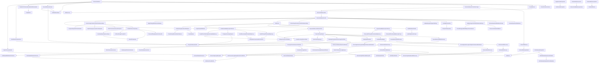

# DbRestoreManager Method Call Graph
Prerequisites: [[WI01017033 - CP2T should adjust schema owner in UserRepository]], [[What is Copy Production to Test]]

```mermaid
flowchart TD
    RestoreDatabases --> CheckDbSchemaVersion
    RestoreDatabases --> CheckBiServer
    RestoreDatabases --> RestoreDatabasesFromRestoreType
    RestoreDatabases --> GetDatabaseStatus
    RestoreDatabases --> RecordDbRestoreDetails
    RestoreDatabases --> DisableCDCWhenAuditAndEdwDBNotAvailable
    RestoreDatabases --> RunDbRestoreSubscribers
    RestoreDatabases --> AdjustRecoveryModels

    AdjustRecoveryModels --> GetActualDatabaseName

    RunDbRestoreSubscribers --> IsTargetDatabaseMainDb

    RestoreDatabasesFromRestoreType --> GetLastDBBackup
    RestoreDatabasesFromRestoreType --> RestoreDatabasesSafe

    CheckBiServer --> BiFilesFound

    GetLastDBBackup --> GetLastDBBackupDetails
    GetLastDBBackupDetails --> FileExists

    RecordDbRestoreDetails --> GetDatabaseStatus
    RecordDbRestoreDetails --> IsTargetDatabaseMainDb
    RecordDbRestoreDetails --> BiFilesFound

    GetBackupDbFileInfoCollection --> GetRelatedDbFileInfoCollection
    GetBackupDbFileInfoCollection --> GetRelatedBiDbFileInfoCollection

    CanDbBeOverwritten --> PromptForReleaseKey

    ApplyExtendedProperties --> GetExtendedProperties

    RestoreDatabasesSafe --> RestoreDatabasesUnsafe

    RestoreDatabasesUnsafe --> ContainsOperationalDatabases
    RestoreDatabasesUnsafe --> RestoreOperationalDatabasesPrompt
    RestoreDatabasesUnsafe --> ValidateCopyProdToTestPreRestoreSettings
    RestoreDatabasesUnsafe --> CanDbBeOverwritten
    RestoreDatabasesUnsafe --> ValidateAlwaysOnSupportSettings
    RestoreDatabasesUnsafe --> PerformCopyProductionToTestPreRestoreSteps
    RestoreDatabasesUnsafe --> DoRestore
    RestoreDatabasesUnsafe --> ApplyChangeAfterRestoreDatabase
    RestoreDatabasesUnsafe --> PerformCopyProductionToTestPostRestoreSteps
    RestoreDatabasesUnsafe --> DropDataVaultDbIfExists

    ValidateCopyProdToTestPreRestoreSettings --> PreserveTestValueFieldExists
    ValidateCopyProdToTestPreRestoreSettings --> CheckMinUpgradableDbMajorSchemaVersion

    PerformCopyProductionToTestPreRestoreSteps --> DropDataVaultDbIfExists

    PerformCopyProductionToTestPostRestoreSteps --> HandleS3AccessKeySetup
    PerformCopyProductionToTestPostRestoreSteps --> ClearProductionInfoFromTestSystem
    PerformCopyProductionToTestPostRestoreSteps --> AdjustCompanyLicensesForTestSystem
    PerformCopyProductionToTestPostRestoreSteps --> CopyAuxiliaryDataToTestDatabase

    HandleS3AccessKeySetup --> RemoveS3RegistryItemsFromAuxDb
    HandleS3AccessKeySetup --> ClearS3Credentials
    HandleS3AccessKeySetup --> IsEDocsStorageProviderS3
    HandleS3AccessKeySetup --> StoreNewReadOnlyAccessKeys

    StoreNewReadOnlyAccessKeys --> ClearS3Credentials

    DisableCDCWhenAuditAndEdwDBNotAvailable --> DisableCDC

    DoRestore --> GetAllDatabaseDetails
    DoRestore --> PrepareAvailabilityGroupForRestore
    DoRestore --> PrepareAndExecuteRestoreTasks
    DoRestore --> FinaliseAvailabilityGroupForRestore
    DoRestore --> CleanExistingOperationalDatabases

    GetAllDatabaseDetails --> AuditSkipRestorePrompt

    PrepareAndExecuteRestoreTasks --> RestorePrimaryReplica
    PrepareAndExecuteRestoreTasks --> CreateSecondaryRestoreTasks

    CreateSecondaryRestoreTasks --> DoRestoreWithNoRecovery

    RestorePrimaryReplica --> ExecuteRestoreWithNoRecovery
    RestorePrimaryReplica --> ExecuteRestoreWithRecovery
    RestorePrimaryReplica --> GrantDatabaseRights
    RestorePrimaryReplica --> AlterDbAuthorisation
    RestorePrimaryReplica --> ReassignSchemaOwnersForCopyProdToTest
    RestorePrimaryReplica --> IsTargetDatabaseMainDb
    RestorePrimaryReplica --> SynchroniseSynonyms
    RestorePrimaryReplica --> ConfigureServerForDatabase

    ReassignSchemaOwnersForCopyProdToTest --> GetSourceDatabaseNameFromBackup
    ReassignSchemaOwnersForCopyProdToTest --> ReassignSchemaOwnersInDatabase

    ReassignSchemaOwnersInDatabase --> GetSchemasOwnedByEnterpriseDbUsers
    ReassignSchemaOwnersInDatabase --> EnsureServerLoginExists
    ReassignSchemaOwnersInDatabase --> EnsureDatabaseUserExists
    ReassignSchemaOwnersInDatabase --> AlterSchemaAuthorization

    EnsureServerLoginExists --> GenerateRandomPassword

    PrepareAvailabilityGroupForRestore --> RemoveDbFromAvailabilityGroupPrompt
    PrepareAvailabilityGroupForRestore --> RemoveAllPrimaryDbFromAvailabilityGroup

    CleanExistingOperationalDatabases --> DropDatabase
    CleanExistingOperationalDatabases --> CleanExistingEDocsInMainDatabase

    FinaliseAvailabilityGroupForRestore --> JoinAllPrimaryDbToAvailabilityGroup
    FinaliseAvailabilityGroupForRestore --> JoinAllSecondaryDbToAvailabilityGroup
    FinaliseAvailabilityGroupForRestore --> ConfigureSecondaryReplicas
    FinaliseAvailabilityGroupForRestore --> DropDbFromOtherReplicasInAvailabilityGroup

    JoinAllSecondaryDbToAvailabilityGroup --> RetryAdminConnectionAfterTimeouts
    JoinAllPrimaryDbToAvailabilityGroup --> RetryAdminConnectionAfterTimeouts

    ExecuteRestoreWithNoRecovery --> DoRestoreWithNoRecovery
    ExecuteRestoreWithRecovery --> DoRestoreWithRecovery

    DoRestoreWithNoRecovery --> RestoreWithNoRecovery
    DoRestoreWithNoRecovery --> RestoreDifferentialBackups
    DoRestoreWithNoRecovery --> RestoreTransactionLogBackups

    DoRestoreWithRecovery --> RestoreWithRecovery

    ConfigureSecondaryReplicas --> IsTargetDatabaseMainDb
    ConfigureSecondaryReplicas --> ConfigureServerForDatabase

    ConfigureServerForDatabase --> IsTargetDatabaseMainDb

    GrantDatabaseRights --> IsTargetDatabaseMainDb
    GrantDatabaseRights --> EnsureApplicationLoginHasRightsToRestoredBiDatabase
    GrantDatabaseRights --> EnsureApplicationLoginHasRightsToRestoredDatabases

    RestoreTransactionLogBackups --> GetActualDatabaseName
    RestoreTransactionLogBackups --> GetTransactionLogBackupFileListFromDbPath
    RestoreTransactionLogBackups --> RestoreSingleLogBackupFile

    GetTransactionLogBackupFileListFromDbPath --> GetFileListFromDbPath

    RestoreDifferentialBackups --> GetActualDatabaseName
    RestoreDifferentialBackups --> FileExists
    RestoreDifferentialBackups --> RestoreSingleDifferentialBackupFile

    RestoreWithRecovery --> RestoreSingleDatabaseWithRecovery

    RestoreWithNoRecovery --> GetFallbackFilePath
    RestoreWithNoRecovery --> GetDatabaseFilePath

    GetRelatedDbFileInfoCollection --> GetFileListFromDbPath

    GetDatabaseBackupFiles --> FileExists
    GetDatabaseBackupFiles --> GetDatabaseBackupFromMetadata

    GetDatabaseBackupFromMetadata --> GetDatabaseBackupFilesFromMetadata

    GetAvailabilityGroupsList --> IsServerAvailabilityGroupListener

    GetAvailabilityGroupName --> GetMainDbName
```
